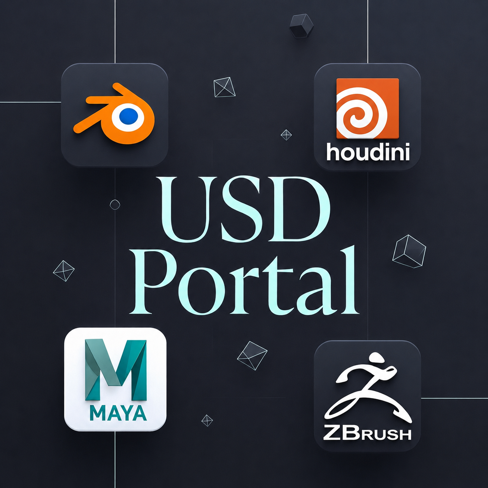

<p align="center">
  
</p>

# USD Portal

**Any-to-any geometry portal between Houdini, ZBrush, Blender and Maya — over USD.**

One click sends geometry from any of the four apps to any other, preserving:

- object / subtool structure (names survive round trips)
- UVs
- **vertex colour** (ZBrush polypaint ⇄ Houdini `Cd` ⇄ Blender color attributes ⇄ Maya colour sets)
- **assigned diffuse textures** (auto-assigned on arrival: Principled Shader in Houdini,
  Principled BSDF in Blender, Texture Map in ZBrush, file texture in Maya)
- **visibility** — hidden objects / subtools / prims never travel
- real-world **scale** (meters convention; Maya's cm handled automatically)

The interchange artifact is a real `.usd` stage you can open in any USD-aware app.

---

## Tested with

| Application | Version | Notes |
|---|---|---|
| **Houdini** | 22.0.368 (Python 3.13, PySide6) | SOPs **and** Solaris/LOPs |
| **ZBrush** | 2026.2 | driven via generated ZScript, no plugin install |
| **Blender** | 5.2.0 LTS | add-on (4.2+ API-compatible) |
| **Maya** | 2026 + mayaUsd 0.32.0 | agent script + USD Portal menu |
| **OS** | Windows 10 / 11 | paths and deploy script are Windows-oriented |

Older/newer versions may work but are untested. Houdini must have its Python 3.13
build (`python3.13libs` is where the module lives).

---

## Install

```powershell
git clone https://github.com/YOUR_USER/usd-portal.git
cd usd-portal
powershell -ExecutionPolicy Bypass -File deploy\deploy.ps1
```

The deploy script:

1. **Houdini** — generates `Documents\houdini22.0\packages\usd_bridge.json` pointing
   at your clone (the Python/shelf load **live** from the repo — edit & restart, no
   re-copy). Edit the generated json to change the ZBrush path or cache dir.
2. **Blender** — copies the add-on to
   `%APPDATA%\Blender Foundation\Blender\5.2\scripts\addons\usd_bridge_blender.py`.
   Enable it once: *Edit ▸ Preferences ▸ Add-ons ▸ "USD Portal"*. Preferences hold
   the cache dir and ZBrush path.
3. **Maya** — copies the agent to `Documents\maya\2026\scripts\usd_bridge_maya.py`
   and appends an autostart line to `userSetup.py` (idempotent).

Then restart the apps. You get:

- **Houdini**: a **USD Portal** shelf (`+` tab ▸ Shelves ▸ USD Portal) with 6 tools
- **Blender**: *View3D ▸ Sidebar (N) ▸ USD Portal* panel
- **Maya**: a **USD Portal** menu in the main menu bar
- **ZBrush**: nothing to install — it is driven remotely via ZScript

> Blender add-on and Maya agent are **copies** — re-run `deploy.ps1` after pulling
> updates. The Houdini package loads live from the repo.

### Requirements

- ZBrush must be **running** for any ZBrush leg (it executes generated ZScripts).
- Blender/Maya must be running with the add-on/agent active for their legs
  (a background watcher answers commands automatically).
- All apps share one cache directory (default `C:\usd_bridge_cache`) — make sure
  every app's config points at the same one.

---

## Usage

### From Houdini (USD Portal shelf)

| Tool | What it does |
|---|---|
| **Get from ZBrush** | Exports every *visible* subtool (GoZ + textures), authors a USD stage, imports it into **SOPs** (polygons with `uv`+`Cd`+Principled Shaders) or **sublayers it into your LOP network** if a LOP net is active. |
| **Send to ZBrush** | Selected SOP (split into subtools by `name`/`path`) or LOP stage → subtools in ZBrush, with vertex colour and textures assigned to Texture Map. |
| **Send to Blender / Send to Maya** | Selected SOP/LOP → USD → auto-imported on the other side. |
| **Get from Blender / Get from Maya** | The other app exports its visible selection (or all visible meshes) → imported into SOPs or LOPs. |

### From Blender (N-panel ▸ USD Portal)

*Get from ZBrush*, *Send to ZBrush* (OBJ + `#MRGB` polypaint + textures),
*Get from Maya*, *Send to Maya* (USD). Houdini legs are driven from Houdini's shelf —
the add-on answers automatically.

### From Maya (USD Portal menu)

*Get from ZBrush*, *Send to ZBrush*, *Get from Blender*, *Send to Blender*, and
**Viewport: Un-tone-mapped Colors** — switches Maya's view transform off ACES tone
mapping so colours match ZBrush/Houdini (display only; data is untouched).

### Selection & visibility rules (all apps)

- **Export pool** = visible objects only. A visible **selection** narrows it; no
  selection = all visible.
- ZBrush: subtool eye icon (folders honoured). Blender: viewport visibility.
  Maya: `visibility` incl. parents. Houdini: LOP invisible prims are pruned,
  SOP `_3d_hidden_primitives` group is dropped.

---

## What travels, exactly

| Data | ZBrush | Houdini | Blender | Maya |
|---|---|---|---|---|
| Mesh + names | subtools | `name`/`path` attrs, prim per subtool | objects | transforms |
| UVs | ✓ | `uv` (vtx) ⇄ `primvars:st` | `st` | `st` / map1 |
| Vertex colour | polypaint | `Cd` ⇄ `primvars:displayColor` (linear) | color attributes | colour sets (sRGB, converted) |
| Diffuse texture | Texture Map | Principled Shader / UsdPreviewSurface | Principled BSDF image | file texture / usdPreviewSurface |
| Units | — | meters | meters | cm (×100 auto) |

Not carried (yet): normal/displacement maps, polygroups→GeomSubset, subdiv creases,
animation, full material graphs beyond the diffuse texture.

---

## Colour & unit conventions (why round trips don't drift)

- USD `displayColor` is **linear**; Houdini `Cd` and Blender color attributes are
  linear — direct mapping.
- **Maya colour sets are display-referred (sRGB)** — mayaUsd itself imports
  displayColor with an sRGB encode. The agent keeps everything coherent: ZBrush
  `#MRGB` bytes go in/out raw, and colour sets are decoded back to linear when
  promoted to `displayColor` on export.
- ZBrush reads OBJ vertex colours as sRGB → senders pre-encode linear `Cd`.
- Scale: **1 unit = 1 meter** everywhere; the Maya agent bakes ×100/÷100 on the
  ZBrush OBJ leg, mayaUsd converts the USD legs.
- Winding: Houdini-native geometry is reversed for ZBrush; USD-unpacked geometry
  (tagged `usdconfigreversepolygons`) is already opposite-wound and sent as-is.

---

## Troubleshooting

| Symptom | Fix |
|---|---|
| *"X did not respond within 120 s"* | The target app isn't running, or its add-on/agent isn't active, or its cache dir differs from the sender's. |
| Texture arrives upside-down | Flip toggles at the top of the relevant agent file (`SEND_FLIP_TEXTURE_V` / `GET_FLIP_TEXTURE_V`). |
| Normals inverted in ZBrush | `SEND_FLIP_NORMALS` in `usd_bridge.py` (should be automatic — see winding note above). |
| Maya viewport looks washed out | USD Portal menu ▸ *Viewport: Un-tone-mapped Colors* (Maya's default ACES view transform tone-maps the display). |
| Vertex colours invisible in Maya but the set has data | The mesh is bound to a usdPreviewSurface material whose VP2 shader ignores CPV — the agent rebinds textureless meshes to the default shading group automatically; for old meshes: `cmds.sets(shape, e=True, forceElement='initialShadingGroup')`. |
| ZBrush: *"Interface item could not be found"* | Usually means the button is **disabled** in the current state (e.g. `SubTool:Duplicate` outside Edit mode), not that the path is wrong. |
| Everything black in Solaris after Get from Blender | Fixed automatically (Blender's world DomeLight is no longer exported; displayColor is wired into materials) — make sure you're on the current version. |

---

## Architecture (short version)

```
                     ┌──────────────── C:/usd_bridge_cache ────────────────┐
 ZBrush ◄─ ZScript ─►│  goz/  send/  tex/        canonical .usd stages     │
   ▲                 │  blender/{cmd,done}.json   maya/{cmd,done}.json     │◄─► Maya agent
   └─ OBJ+#MRGB ────►│        (atomic JSON command protocol)               │    (QTimer)
                     └──────────────────────────────────────────────────────┘
 Houdini package ◄────────── pxr authoring / usdimport / sublayer ─────────► Blender add-on
 (shelf, live)                                                               (watcher, panel)
```

- ZBrush has no scripting API for file-targeted USD, so its legs run over
  GoZ/OBJ driven by generated ZScript, and the USD is authored by the peer app.
- Houdini⇄Blender⇄Maya legs are pure USD + a tiny `cmd.json`/`done.json` protocol.
- Every producer normalizes its output (colour primvars → `displayColor`, empty
  materials stripped, invisible prims pruned) so consumers stay simple.

## Repository layout

```
package/usd_bridge/            Houdini package (python3.13libs, shelf, icons)
package/blender/addons/        Blender add-on
package/maya/scripts/          Maya agent
deploy/deploy.ps1              one-shot installer for all three apps
tests/test_usd_writer.py       head-less round-trip suite (hython)
```

## Tests

Head-less round-trip suite (no ZBrush needed), run with Houdini's hython:

```bash
"C:/Program Files/Side Effects Software/Houdini 22.0.368/bin/hython.exe" tests/test_usd_writer.py
```

61 checks: USD authoring, materials, promotion/wiring fixes, winding, visibility,
command protocol. Expected: `RESULT: PASS`.

## Roadmap

- Normal / displacement maps (ZBrush Multi Map Exporter)
- Polygroups ⇄ USD GeomSubsets
- Update-existing-subtool-by-name on send (true sculpt iteration)
- Linux/macOS deploy scripts

## License

[MIT](LICENSE) © 2026 Eugene Fokin
